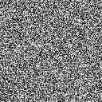
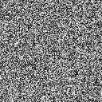

# MNIST Diffusion Model

This project demonstrates how to train a diffusion model on the MNIST dataset to generate synthetic images and visualize the denoising process through GIF animations. The model is implemented in PyTorch, utilizing a U-Net architecture and Gaussian diffusion sampling.

## Project Overview

This project aims to:

- Train a U-Net-based diffusion model on the MNIST dataset.
- Visualize the denoising process from Gaussian noise to MNIST images in GIF format.
- Generate and display sample images from the trained model.

## Requirements

The code requires the following packages and versions:

- `Python`: 3.12.2+
- `torch`: 2.5.1+cu124
- `numpy`: 2.0.2
- `Pillow`: 11.0.0

Ensure you have these versions installed to avoid compatibility issues.

## Noising Process Visualization

The GIF below shows the noising process of the model applied to a noisy MNIST image:

## Deoising Process Visualization

